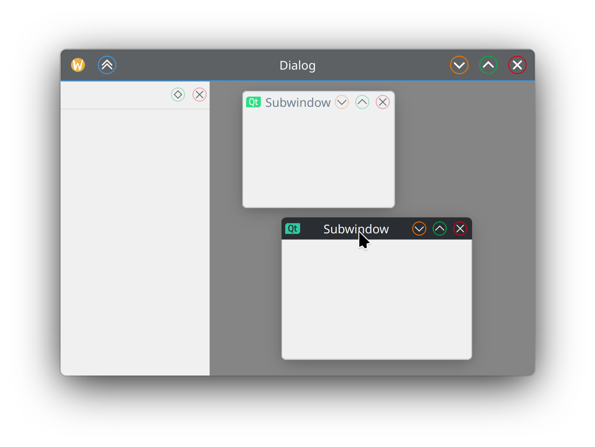

# Klassy


##### Table of Contents
[Overview](#overview)  
>[Main _Kite_ Global theme](#kite)  
>[Customizability](#customizability)

[Installation](#installation)  
>[Pre-built packages](#prebuilt)  
>[Compile from source](#compile)  
>[Gentoo Linux package](#gentoo-linux-package)
   
[Donations](#donations)

&nbsp;

<a name="overview"/>

## Overview
_Klassy_ is a theming utility for the KDE Plasma desktop environment. It consists of a Global Theme which applies several components: Window Decoration, Application Style, Colour Scheme, Plasma style, and Icons. The Klassy Application Style has arguably the best scrollbars on any platform.

<a name="kite"/>

### Main _Kite_ global theme
After [installing](#installation), it is recommended to first try the main Global Theme, called _Kite_.

The global theme is enabled in System Settings->Colours & Themes->Global Theme. NB: you need to initially use the Global Theme settings screen to apply the theme properly; if you intially apply via the Quick Settings screen or the Light/Dark selector then the full Desktop & window layout will not be applied. Afterwards, you can set Light/Dark switching for day/night, respectively.

Left panel theme selection (recommended for 16:9 laptops):


Bottom panel theme selection (recommended for everything else):


The default _Kite_ theme is designed to be pragmatic for long-term every-day use, not for instant likes on social media or "ricing" sites. _Kite_ is the result of Paul A McAuley evolving the _Breeze_ theme to be arguably more polished and usable, with influences from the original Breeze design, the "Blue Ocean" refresh, and the original KDE 1. A kite floats in the breeze! [See the _Kite defaults design decisions_ document for full design details](https://github.com/paulmcauley/klassy/discussions/263).

<a name="customizability"/>

## Customizability
_Klassy_ is highly customizable - you can make your system as classy or unclassy as you like!

For easy customization, the _Klassy Settings_ GUI application is installed. `klassy-settings` also has command-line options to allow Preset file imports, load Presets and generate system icons. Run `klassy-settings --help` for details.

It is recommended to first try the bundled Presets in Klassy Settings before any fine-tuning:


* Provides numerous built-in perfectly-pixel-snapped button icons, as well as the ability to display `window-*-symbolic` system icons:
  
>(Above Preset: _Glassy Klassy_)

* Provides an Application Style aso that icons in dockable panels, MDI applications and application tabs are consistent (make sure to enable the _Klassy_ Application Style):
  
  
>(Above Preset: _Chroma_)

* Provides an Icon theme so that context menus and GTK applications consistently match the main titlebar icons (make sure to enable the _Klassy_ system icon theme and configure the icons by clicking "System Icon Generation..." in _Klassy Settings_):
  
  

* Configurable button size, shape, translucency, colours and outlining.

* Default buttons are "Integrated Rounded Rectangles" with translucent outlined accent colours, with a large clickable area. These are designed to complement the "Blue Ocean" design refresh, along with the system accent colour feature. Shown below with _Klasse_ icons (inspired by KDE1):
  
   
  
* Alternative "Traffic lights" background colours:
  
   

* Alternative "Full-height Rounded Rectangle" button shape (_ClassiK v3_ preset):
  
   
   
   


* Full-height Rectangular (_ClassikStyles_ preset) or Circular (_Classik-Aurorae_ preset) button highlights:
   

* Ability to inherit system colour-scheme highlight colours for hover and focus, as well as titlebar colour. Auto-enhances contrast in cases where it is poor.
* Option to have matching titlebar colour and border colour.

* Configurable button spacing (left and right), titlebar margins (sides, top/bottom and option for different maximized), corner radius; all with scaling for HiDPI:


* Transparency/opacity configurable for both active/inactive titlebars/headers; setting to make maximized windows opaque; blur is configurable.

* Configurable thin window outline with optional accent colours:

")

* Configurable scrollbars:
 


* Configurable animations

&nbsp;

<a name="installation"/>

## Installation
_Klassy_ plasma6.5 branch requires Plasma 6.5, or later, so please check you have this in kinfocenter before trying to install. For the master branch you should compile from source.
<a name="prebuilt"/>

### Pre-built packages
[Respositories are available from the Open Build Service](https://software.opensuse.org/download.html?project=home%3Apaul4us&package=klassy) for OpenSUSE, Debian/Ubuntu, Fedora, Mageia and Arch/Manjaro to keep you on the latest version.


Raw .rpm, .deb etc. binary packages are also available from the Open Build Service link above if you choose "Grab binary packages directly". 
&nbsp;
&nbsp;

<a name="compile"/>

### Compile from source
### Step 1: First, Install Dependencies
#### OpenSUSE Tumbleweed/Leap build dependencies
```
sudo zypper in git cmake kf6-extra-cmake-modules gettext
```

```
sudo zypper in "cmake(KF5Config)" "cmake(KF5CoreAddons)" "cmake(KF5FrameworkIntegration)"  "cmake(KF5GuiAddons)" "cmake(KF5Kirigami2)" "cmake(KF5WindowSystem)" "cmake(KF5I18n)" "cmake(KF5KCMUtils)" "cmake(Qt5DBus)" "cmake(Qt5Quick)" "cmake(Qt5Widgets)" "cmake(Qt5X11Extras)" "cmake(KDecoration3)" "cmake(KF6ColorScheme)" "cmake(KF6Config)" "cmake(KF6CoreAddons)" "cmake(KF6FrameworkIntegration)" "cmake(KF6GuiAddons)" "cmake(KF6I18n)" "cmake(KF6KCMUtils)" "cmake(KF6KirigamiPlatform)" "cmake(KF6WindowSystem)" "cmake(Qt6Core)" "cmake(Qt6DBus)" "cmake(Qt6Quick)" "cmake(Qt6Svg)" "cmake(Qt6Widgets)" "cmake(Qt6Xml)"
```

#### Debian/Ubuntu build dependencies
```
sudo apt install git build-essential cmake extra-cmake-modules libkirigami-dev libkf5style-dev libkf6kcmutils-dev libkf6colorscheme-dev libkf5config-dev libkf5configwidgets-dev libkf5coreaddons-dev libkf5guiaddons-dev libkf6i18n-dev libkf6iconthemes-dev kirigami2-dev libkf6package-dev libkf6service-dev libkf6windowsystem-dev kwayland-dev libx11-dev libkdecorations3-dev libkf5configwidgets-dev libkf5i18n-dev libkf5iconthemes-dev libkf5kcmutils-dev libkf5package-dev libkf5service-dev libkf5wayland-dev libkf5windowsystem-dev libplasma-dev libqt5x11extras5-dev qt6-base-dev qt6-declarative-dev qtbase5-dev qtdeclarative5-dev gettext qt6-svg-dev
```

#### KDE Neon / TUXEDO OS build dependencies
```
sudo apt install git build-essential cmake kf6-extra-cmake-modules kf6-extra-cmake-modules kf6-frameworkintegration-dev kf6-kcmutils-dev kf6-kcolorscheme-dev kf6-kconfig-dev kf6-kconfigwidgets-dev kf6-kcoreaddons-dev kf6-kguiaddons-dev kf6-ki18n-dev kf6-kiconthemes-dev kf6-kirigami2-dev kf6-kpackage-dev kf6-kservice-dev kf6-kwindowsystem-dev kirigami2-dev kwayland-dev libx11-dev libkdecorations3-dev libkf5config-dev libkf5configwidgets-dev libkf5coreaddons-dev libkf5guiaddons-dev libkf5i18n-dev libkf5iconthemes-dev libkf5kcmutils-dev libkf5package-dev libkf5service-dev libkf5style-dev libkf5wayland-dev libkf5windowsystem-dev libplasma-dev libqt5x11extras5-dev qt6-base-dev qt6-declarative-dev qtbase5-dev qtdeclarative5-dev gettext qt6-svg-dev
```

#### Arch/Manjaro build dependencies
```
sudo pacman -S git frameworkintegration gcc-libs glibc kcmutils kcolorscheme kconfig kcoreaddons kdecoration kguiaddons ki18n kiconthemes kirigami kwidgetsaddons kwindowsystem qt6-base qt6-declarative qt6-svg xdg-utils extra-cmake-modules kcmutils5 frameworkintegration5 kconfigwidgets5 kiconthemes5 kirigami2 kwindowsystem5
```

#### Fedora build dependencies
```
sudo dnf install git cmake extra-cmake-modules gettext
```

```
sudo dnf install "cmake(KF5Config)" "cmake(KF5CoreAddons)" "cmake(KF5FrameworkIntegration)"  "cmake(KF5GuiAddons)" "cmake(KF5Kirigami2)" "cmake(KF5WindowSystem)" "cmake(KF5I18n)" "cmake(Qt5DBus)" "cmake(Qt5Quick)" "cmake(Qt5Widgets)" "cmake(Qt5X11Extras)" "cmake(KDecoration3)" "cmake(KF6ColorScheme)" "cmake(KF6Config)" "cmake(KF6CoreAddons)" "cmake(KF6FrameworkIntegration)" "cmake(KF6GuiAddons)" "cmake(KF6I18n)" "cmake(KF6KCMUtils)" "cmake(KF6KirigamiPlatform)" "cmake(KF6WindowSystem)" "cmake(Qt6Core)" "cmake(Qt6DBus)" "cmake(Qt6Quick)" "cmake(Qt6Svg)" "cmake(Qt6Widgets)" "cmake(Qt6Xml)"
```

### Step 2: Then download, build and install
Download, build and install from source script:
```
git clone https://github.com/paulmcauley/klassy
```

```
cd klassy
```

```
git checkout plasma6.5
```

```
./install.sh
```

Uninstall build script:

```
./uninstall.sh
```

&nbsp;
### Gentoo Linux package
There is a package available for Klassy in the [guru](https://github.com/gentoo/guru) repository.
You can install Klassy on Gentoo Linux by following these steps.

First, install the `eselect repository` module with:
```
sudo emerge -av app-eselect/eselect-repository
```

Enable the `guru` repository by executing:
```
sudo eselect repository enable guru
```

Sync the repositories:
```
sudo emaint sync -r guru
```

Add the package keywords to `/etc/portage/package.accept_keywords`:
```
echo "=gui-apps/klassy-9999::guru **" | sudo tee /etc/portage/package.accept_keywords/klassy 
```

Finally, compile & install the package with:
```
sudo emerge -av =gui-apps/klassy-9999::guru
```

<a name="donations"/>

## Donations
[](https://liberapay.com/paulmcauley/donate)
or [](https://www.paypal.com/donate?business=6N9RP4LDLNZCC&currency_code=GBP)
